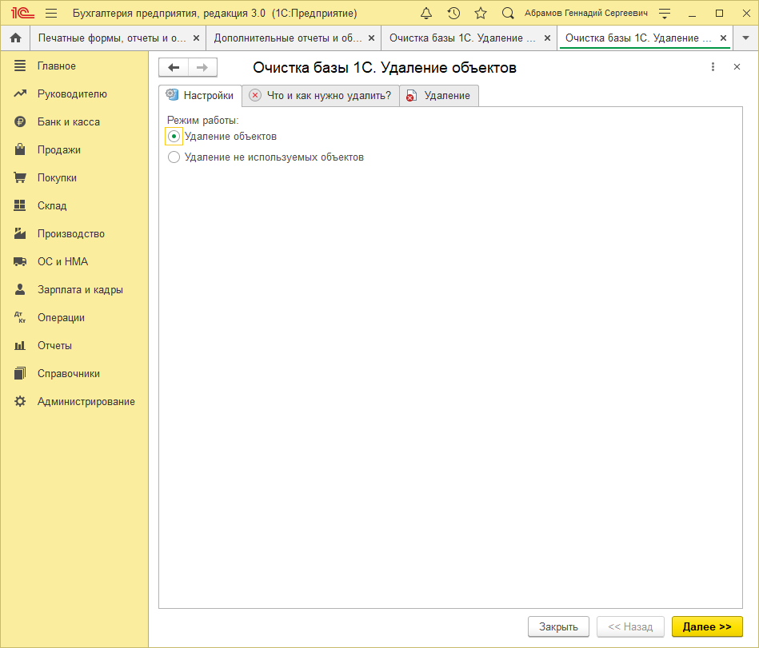
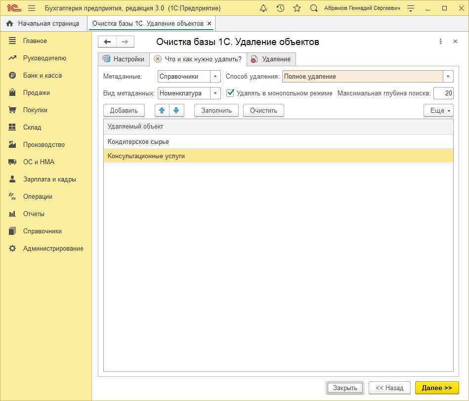
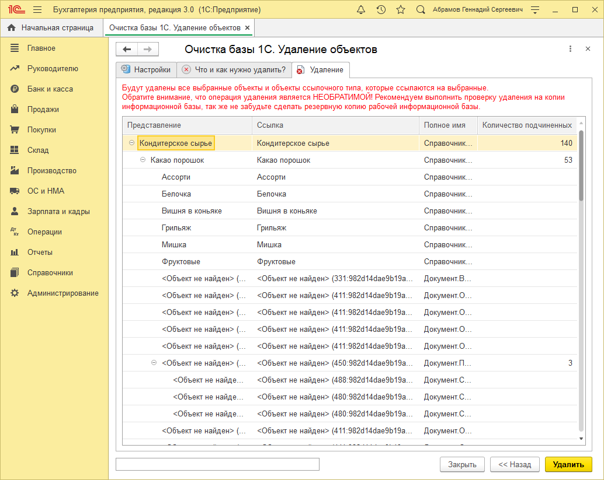

# Настройка обработки 

## Настройка обработки "Универсальное удаление данных из 1С"
При запуске обработки открывается закладка "Настройки", где расположен выбор одного из двух вариантов работы.   
> * Удаление объектов - основной режим работы обработки, который позволяет произвести универсальное удаление данных из базы 1С;  
> * Удаление не используемых объектов - режим работы, который осуществляет строгий отбор и удаление только не используемых объектов информационной базы.  

Выбрав один из режимов работы, переходим на закладку "Что и как нужно удалить?", где продолжим настройку обработки перед началом удаления данных. На данной закладке располагается следующий набор реквизитов:  

> * **Метаданные** - указываются метаданные, в которых будет осуществляться выборка объектов для удаления, может принимать значения (справочники, документы, планы видов характеристик, планы счетов, планы видов расчетов, бизнес-процессы, задачи, планы обмена);
> * **Вид метаданных** - уточняющий реквизит, в котором указывается конкретный вид метаданных, например, справочник "Номенклатура";
> * **Способ удаления** - выпадающий список выбора различных способов удаления, на текущий момент доступен только вариант полного удаления;
> * **Удалять в монопольном режиме** - осуществляет удаление в монопольном режиме, что позволяет ускорить процесс удаления большого количества данных;
> * **Максимальная глубина поиска** - устанавливает уровень поиска максимальной ссылочной зависимости выбранного объекта.По умолчанию максимальная глубина поиска равна 3.  
В табличной части "Удаляемый объект" указывается или указываются объекты информационной базы, которые необходимо удалить. С помощью кнопки `"Добавить"` добавляется один объект, а если необходимо добавить на удаление все объекты выбранного вида метаданных, тогда нужно воспользоваться кнопкой `"Заполнить"`. Кнопка `"Очистить"` позволяет полностью убрать добавленные объекты из табличной части. Нажав кнопку `"Далее"`, перейдем процессу удаления объектов.

На закладке `"Удаление"` отображаются все найденные объекты, которые представлены в виде ссылочной зависимости. То есть, на предыдущем шаге были выбраны два вида метаданных, по которым были найдены все зависимые объекты и представлены на удаление.  

!!! warning
Данные манипуляции полностью идентичны для использования обработки в конфигурациях на обычных формах.
!!!