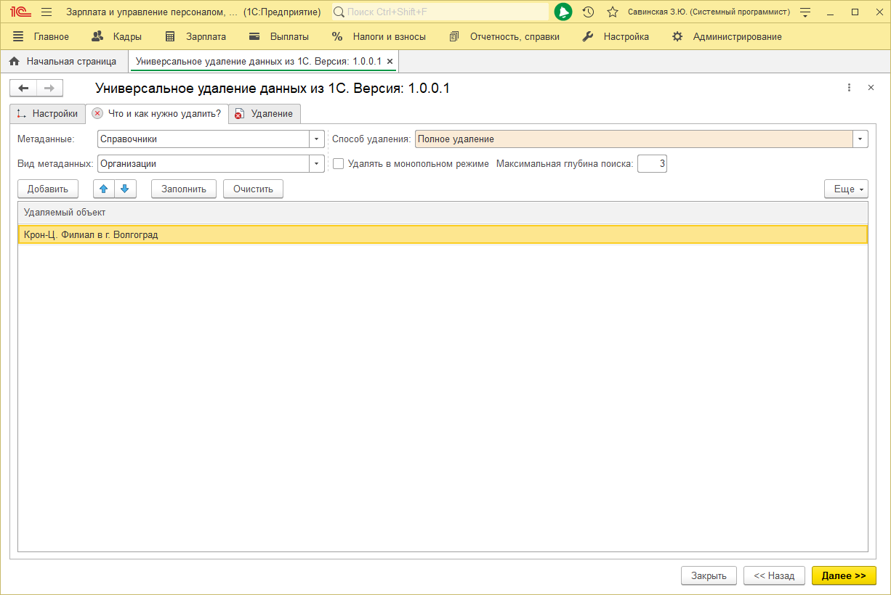
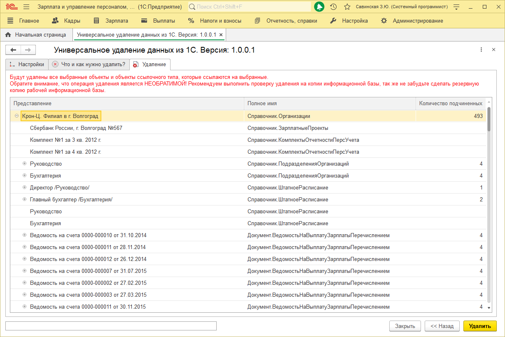
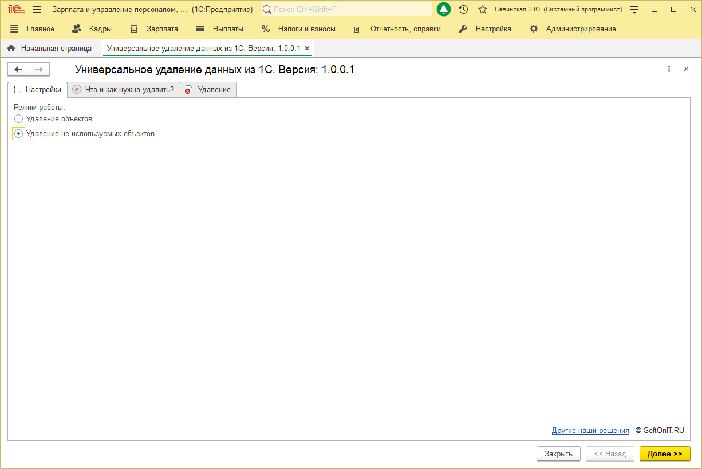
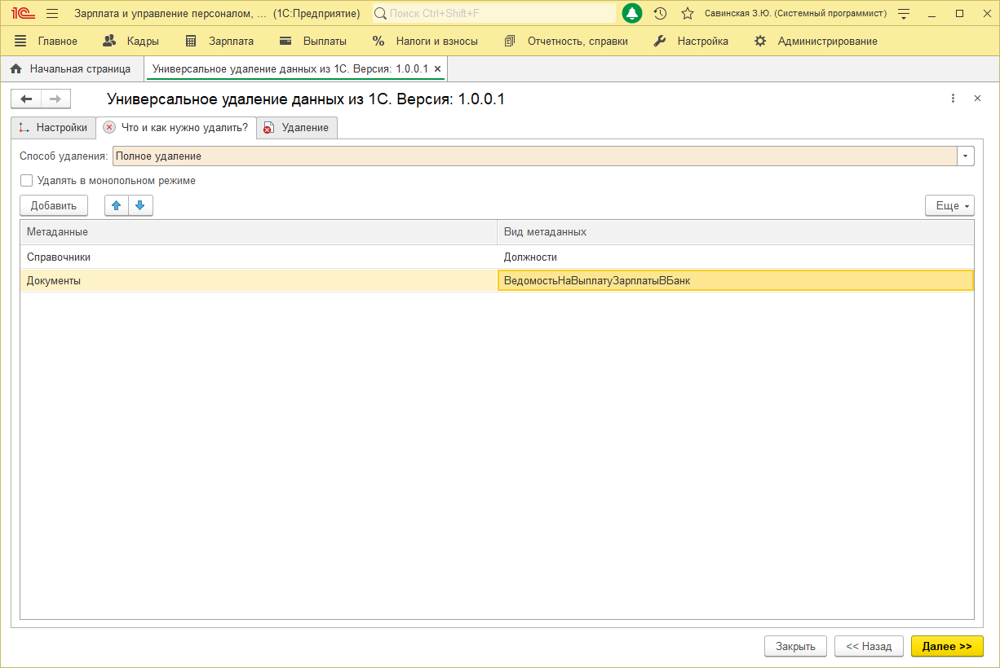
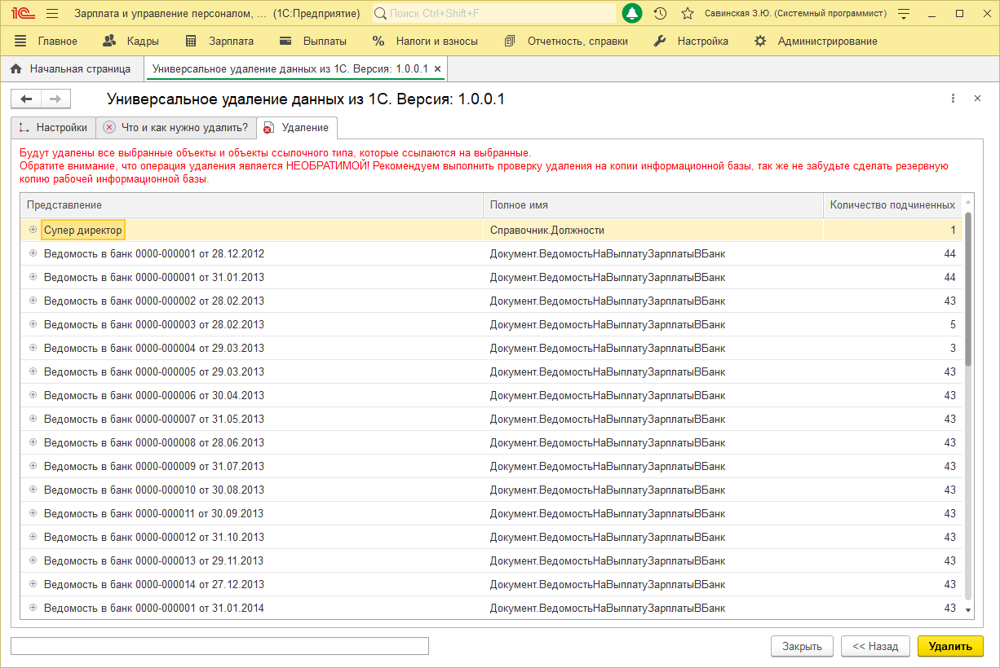

# Очистка базы данных 1С

# Очистка информационной базы от ненужной информации

!!! Danger
Внимание!!! Перед использованием обязательно создайте резервную копию информационной базы.
!!!

Данная обработка позволит выполнить очистку информационной базы от ненужной информации, а так же от информации, которая больше не используется. Работа осуществляется в двух режимах, режим **"Удаление объектов"** и режим **"Удаление не используемых объектов"**.

## Режим работы "Удаление объектов"

Режим позволяет выбрать и удалить данные из информационной базы. Для этого нужно настроить отбор на странице **"Что и как нужно удалить?"**.

> * **Способ удаления** - непосредственное удаление данных (без пометки на удаление);  
> * **Удалять в монопольном режиме** - позволяет удалять данные в монопольном режиме, что может значительно уменьшить время выполнения;  
> * **Максимальная глубина поиска** - поиск ссылок по ссылкам, по умолчанию поиск осуществляется рекурсивно на глубину равную 3.  

На странице "Удаление" можно увидеть данные в виде дерева, которые будут удалены.

## Режим работы "Удаление не используемых объектов"

Режим позволяет найти данные, которые нигде не используются (ошибочно заведены). Для этого нужно настроить отбор на странице **"Что и как нужно удалить?"**.

> * **Максимальная глубина поиска** - поиск ссылок по ссылкам, по умолчанию поиск осуществляется рекурсивно на глубину равную 3.

На странице "Удаление" можно увидеть данные в виде дерева, которые будут удалены.

