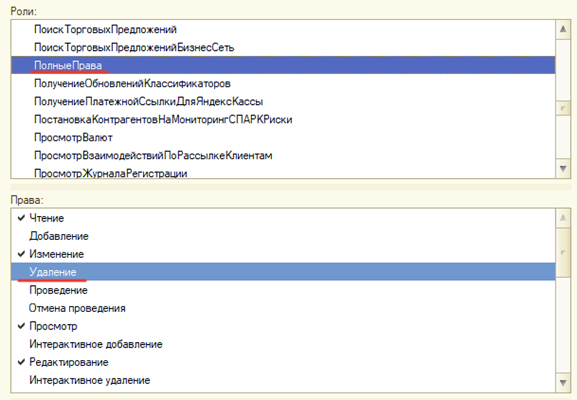

# После очистки данных

!!! info 
Обработка "по максимуму собирает связанные объекты" и пытается удалить с программным контролем, который реализован в обработке, но все-таки эта возможность не штатная и возможны ситуации, что не все объекты удалятся/не удалятся с контролем целостности. Поэтому нужно после сделать тестирование и исправление.
!!!

## Проверка ссылочной целостности
После того как было выполнено удаление данных, необходимо сделать проверку ссылочной целостности конфигурации. В конфигураторе перейдите в раздел: `Администрирование -> Тестирование и исправление… -> `И установите настройки, которые указаны на скриншоте ниже:

!!! info 
Обработка удаления данных из 1С действительно является универсальной, но стоит отметить то, что после удаления некоторых объектов иногда возникают «битые» ссылки при проверкие ссылочной целостности в конфигураторе.  
!!!

Если вы столкнулись с такими ошибками, тогда попробуйте установить максимальную глубину поиска (50), и попробовать запустить обработку удаления снова.

Если в итоге ошибки остались, тогда разберемся, из-за чего они возникают.  
## Причины возникновения «битых» ссылок

> * **Обращение к удаленным объектам.**  
После удаления объекта или очистки записей регистров срабатывает подписка на событие выполняя код 1С, которая может обращаться к уже удаленным объектам. В итоге сработает исключение и объект не будет удален, конечно, большинство таких событий сразу же блокируется обработкой, но в некоторых модулях объекта, данная блокировка не предусмотрена, т.к. она не была реализована разработчиком конфигурации, на которой производится удаление

> * **Нет прав на удаление объекта.**
Бывает такое, что в конфигурациях у пользователя нет прав на удаление или пометка на удаление объектов. Следовательно обработка не удаляет те объекты, у которых стоит запрет.

> **Решение:** создать расширение, в котором будет роль с полными правами на удаления объектов.  
> Либо если конфигурация снята с поддержки и разрешено редактирование, то сделайте это без расширения.

## Чистка «битых» ссылок после удаления объектов
Процедура аналогична поиску «битых» ссылок только с дополнительными настройками:

После очистки убеждаемся, что «битых» ссылок больше нет.

Теперь заходим в конфигурацию, и находим те объекты, у которых очистились пустые ссылки.

До очистки:

После очистки:

Как видим ссылки на несуществующие объекты очищены.
Далее нужно удалить объекты, которые ранее ссылались на удаленные объекты.

