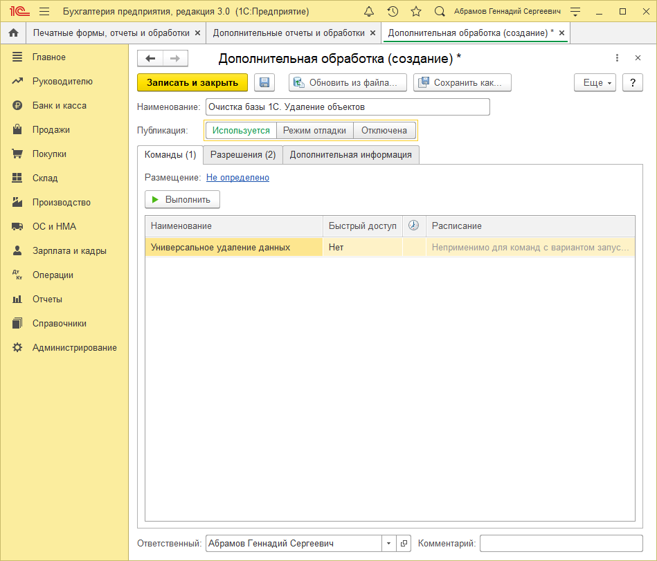
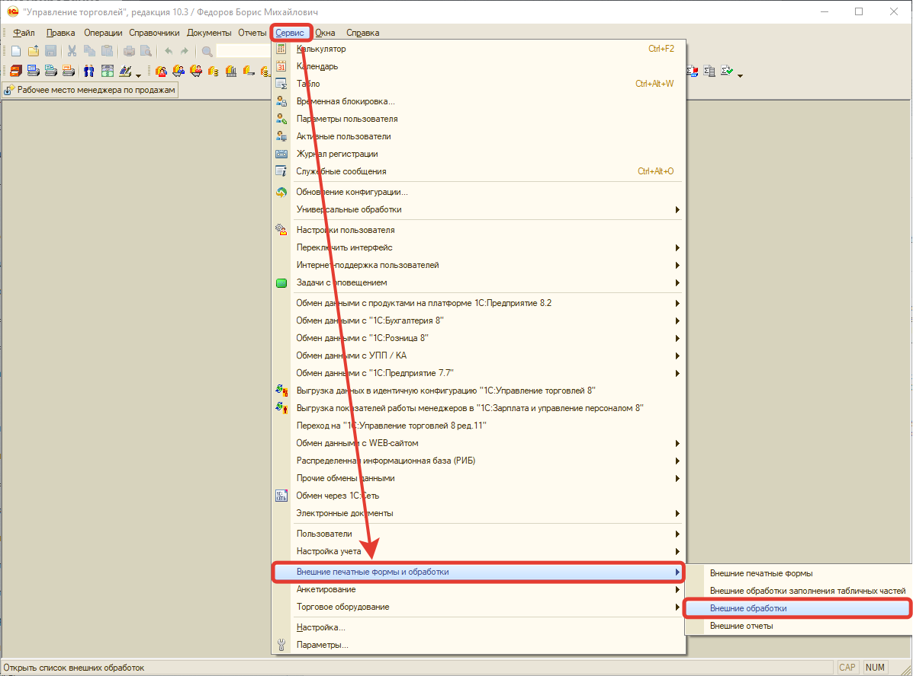
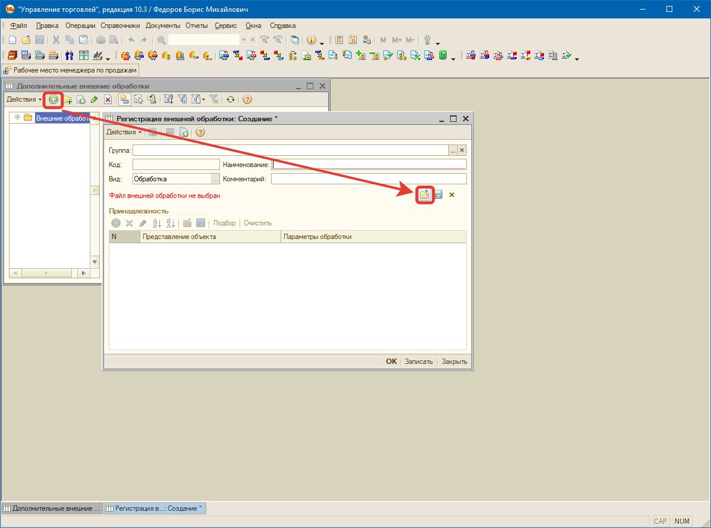

# Установка обработки "Универсальное удаление данных из 1С"

Перед тем как приступить к работе с обработкой **"Универсальное удаление данных из 1С"** нужно первым делом ее установить. Для этого запускаем рабочую конфигурацию, в качестве примера будет использована "Бухгалтерия предприятия 3.0". Переходим в раздел `"Администрирование"-"Печатные формы, отчеты и обработки"-"Дополнительные отчеты и обработки"` и нажимаем кнопку `"Добавить из файла".` Выбираем файл обработки, после чего можно нажать кнопку `"Выполнить"` и приступать к работе.

Добавление обработки в конфигурации на обычных формах осуществляется практически аналогично. Отрываем конфигурацию и переходим в раздел `"Сервис"-"Внешние печатные формы и обработки"-"Внешние обработки"`.

И чтобы добавить новую обработку необходимо нажать кнопку `"Добавить"` и следом кнопку `"Заменить файл внешней обработки"`, после чего выбрать файл обработки. После этого, можно приступать к работе.

